# S.I.G.A.D.

## Sistema Integral de Gestión de Asistencia Docente

S.I.G.A.D. es una aplicación web destinada a la administración de cursos, alumnos y asistencias docentes. El sistema permite centralizar información académica, consultar estadísticas y generar informes, diferenciando las operaciones disponibles según el rol de cada usuario.

### Acceso público

- **Aplicación web:** [https://sigad.vercel.app](https://sigad.vercel.app)
- **Backend PocketBase:** [https://sigad-demo.pockethost.io](https://sigad-demo.pockethost.io)

## Problema abordado

El registro manual o distribuido de cursos, estudiantes y asistencias dificulta el seguimiento de la actividad docente, la consulta de estadísticas y la elaboración de informes. S.I.G.A.D. reúne estas tareas en una única plataforma accesible desde computadoras y dispositivos móviles.

El proyecto también contempla un modelo de servicio comercial: cada docente puede solicitar una cuenta, presentar un comprobante de pago y administrar hasta diez cursos propios durante el período de vigencia de su suscripción.

## Usuarios y roles

### Docente

- Gestiona únicamente sus cursos.
- Puede crear hasta diez cursos activos.
- Administra alumnos y registros de asistencia.
- Consulta estadísticas y exporta informes en PDF.
- Actualiza su perfil y gestiona la renovación del servicio.

### Administrador

- Visualiza y supervisa todos los cursos.
- Administra las cuentas docentes.
- Activa o desactiva usuarios.
- Revisa solicitudes, pagos y comprobantes.
- Aprueba o rechaza solicitudes y renovaciones.
- También puede gestionar sus propios cursos como docente.

### Solicitante público

- Consulta los planes disponibles.
- Envía una solicitud de acceso con su comprobante.
- Consulta posteriormente el estado de la solicitud.

## Funcionalidades principales

- Inicio y cierre de sesión.
- Recuperación y cambio de contraseña.
- Control de acceso mediante roles de administrador y docente.
- Gestión de cursos propios con un límite de diez por docente.
- Alta, edición y eliminación de alumnos.
- Registro de asistencia como Presente, Ausente o Tardanza.
- Consulta de estadísticas de asistencia.
- Exportación de planillas e informes en formato PDF.
- Generación de un informe antes de eliminar un curso.
- Administración de docentes y suscripciones.
- Presentación y revisión de pagos y solicitudes.
- Consulta pública del estado de una solicitud.
- Avisos anticipados de vencimiento.
- Interfaz adaptable a computadoras y teléfonos celulares.

## Tecnologías utilizadas

- **React:** construcción de la interfaz de usuario.
- **Vite:** entorno de desarrollo y compilación del frontend.
- **React Router:** navegación de la aplicación SPA.
- **PocketBase:** autenticación, base de datos, archivos y API.
- **Vercel:** alojamiento y publicación del frontend.
- **PocketHost:** alojamiento del backend PocketBase.
- **SweetAlert2:** mensajes, alertas y confirmaciones.
- **jsPDF y jsPDF AutoTable:** generación de informes PDF.
- **CSS:** diseño visual y adaptación responsiva.

## Arquitectura y despliegue

El frontend es una aplicación SPA desarrollada con React y publicada en Vercel. Las rutas internas son redirigidas a `index.html` mediante `vercel.json`, lo que permite recargar pantallas como `/dashboard` sin obtener errores 404.

El backend está implementado con PocketBase y desplegado en PocketHost. La dirección del servicio se configura mediante la variable de entorno `VITE_POCKETBASE_URL`.

Colecciones principales:

- `users`
- `cursos`
- `alumnos`
- `asistencias`
- `pagos`
- `solicitudes`

## Instalación local

### Requisitos

- Node.js 20 o superior.
- npm.
- Acceso al backend configurado en PocketHost o a una instancia local de PocketBase.

### Pasos

1. Clonar el repositorio y abrir la carpeta `SIGAD-frontend`.
2. Instalar las dependencias:

```bash
npm install
```

3. Crear un archivo `.env` local con la dirección del backend:

```env
VITE_POCKETBASE_URL=https://sigad-demo.pockethost.io
```

4. Iniciar el entorno de desarrollo:

```bash
npm run dev
```

La aplicación estará disponible normalmente en `http://localhost:5173`.

El archivo `.env` contiene configuración local y no debe incorporarse al repositorio. El proyecto incluye `.env.example` como referencia, sin credenciales privadas.

## Comandos disponibles

```bash
npm run dev      # Inicia el entorno de desarrollo
npm run build    # Genera la versión de producción
npm run lint     # Ejecuta el análisis estático
npm run preview  # Previsualiza la compilación
```

## Capturas de pantalla

### Página principal

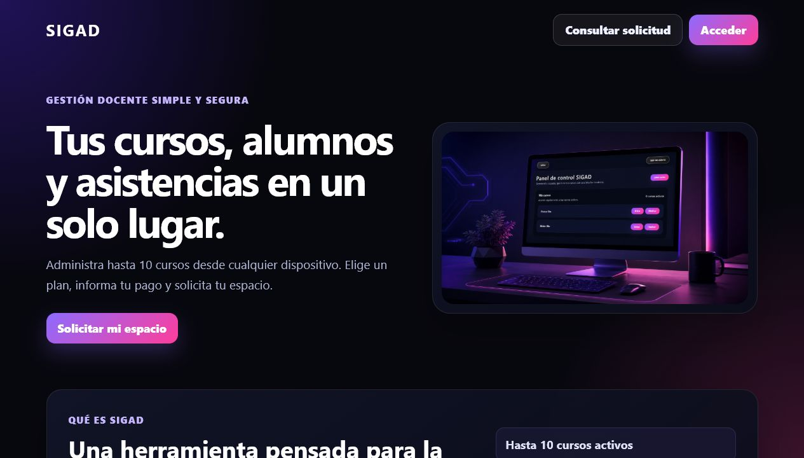

### Inicio de sesión

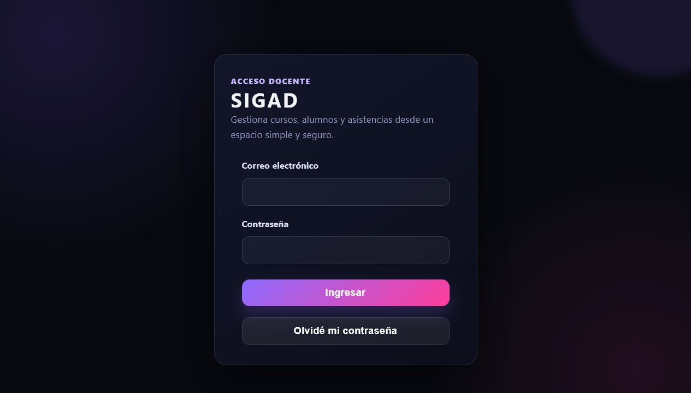

### Dashboard administrador

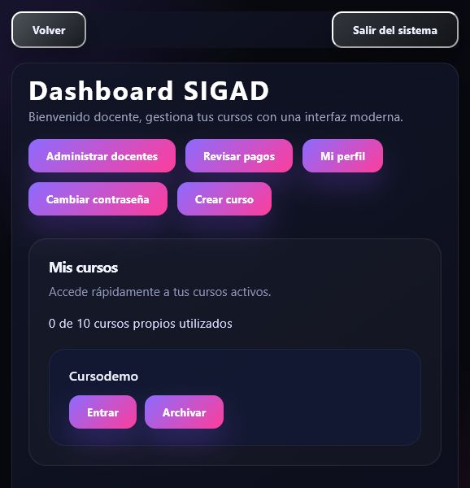

### Administración de docentes

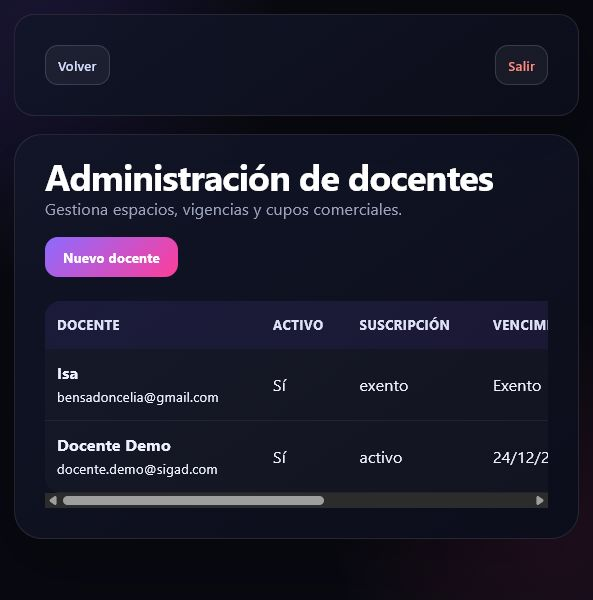

### Revisión de pagos y solicitudes

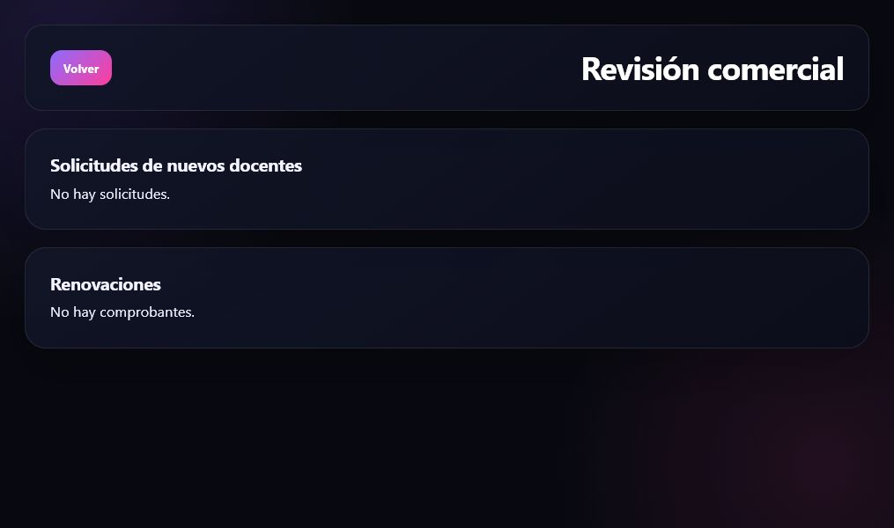

### Dashboard docente

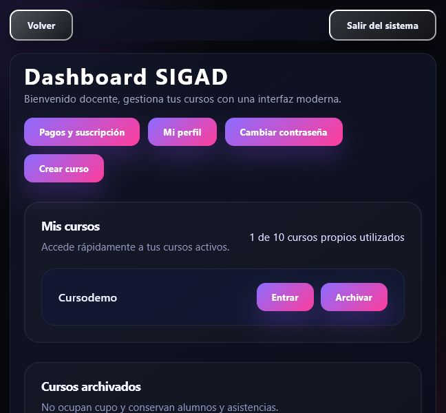

### Gestión de cursos

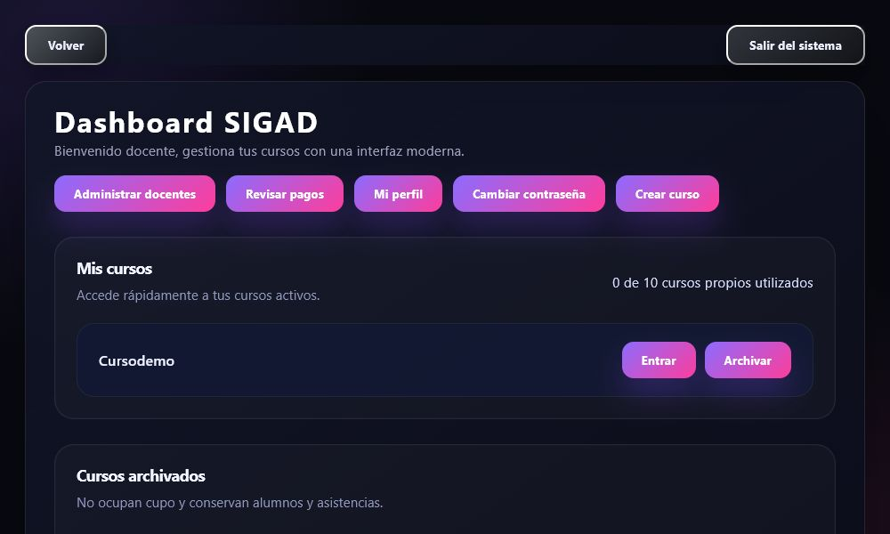

### Detalle del curso y alumnos

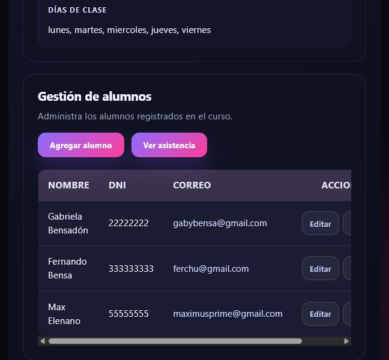

### Planilla de asistencia

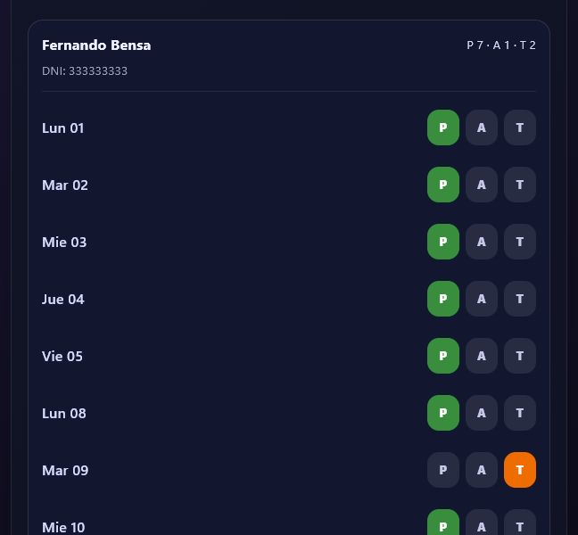

### Estadísticas

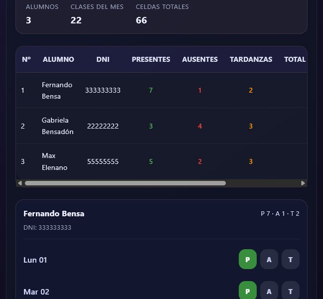

### Informe PDF

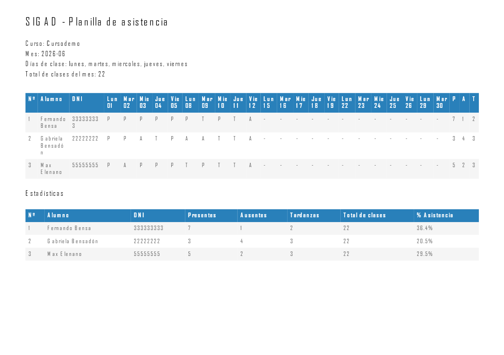

Las capturas corresponden a pantallas reales de la aplicación desplegada y muestran los principales flujos del sistema: acceso, administración, gestión docente, asistencia y estadísticas.

## Uso de inteligencia artificial

Durante el desarrollo se utilizaron herramientas de inteligencia artificial como apoyo para:

- Analizar y organizar los requisitos.
- Evaluar alternativas de diseño e implementación.
- Revisar código y detectar posibles mejoras.
- Refinar la experiencia de usuario y los mensajes de la interfaz.
- Elaborar y actualizar documentación técnica y funcional.
- Preparar casos de prueba y verificar escenarios de uso.

Las decisiones funcionales, la selección de los cambios, las pruebas y la validación final fueron realizadas por la responsable del proyecto. S.I.G.A.D. no requiere servicios de inteligencia artificial para funcionar en producción.

## Seguridad y privacidad

- Las reglas de acceso de PocketBase restringen la información según el usuario autenticado.
- Un docente no debe acceder a cursos, alumnos o asistencias pertenecientes a otra cuenta.
- Los comprobantes y datos personales son de acceso administrativo.
- Los archivos `.env`, bases de datos, copias de seguridad y credenciales no deben publicarse.
- La aplicación desplegada utiliza conexiones HTTPS.

## Estado actual

El frontend se encuentra publicado en Vercel y conectado al backend desplegado en PocketHost. Las funciones principales de autenticación, administración, cursos, alumnos, asistencias, estadísticas, pagos, solicitudes e informes están implementadas.

Las pruebas manuales recomendadas para la entrega están documentadas en [TESTING.md](TESTING.md).

## Mejoras futuras

- Configurar y verificar el envío real de correos mediante SMTP.
- Automatizar copias de seguridad externas de PocketBase.
- Incorporar monitoreo y registro centralizado de errores.
- Realizar pruebas periódicas de restauración de copias de seguridad.
- Definir políticas formales de conservación y eliminación de datos personales y comprobantes.
- Optimizar la división del paquete JavaScript para reducir el tamaño de la carga inicial.
- Ampliar las pruebas automatizadas y de seguridad.

## Licencia

Proyecto desarrollado con fines académicos y con proyección de uso comercial. No se autoriza su copia, redistribución o explotación sin permiso de su titular.
