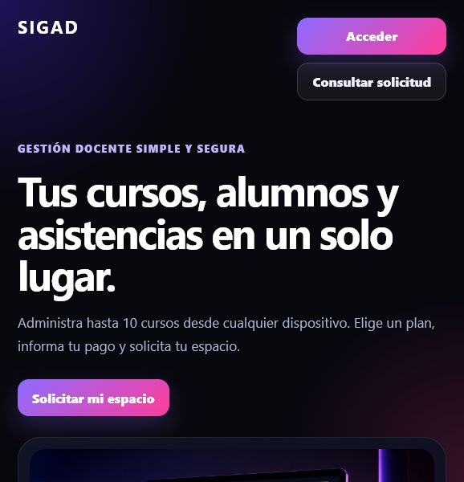
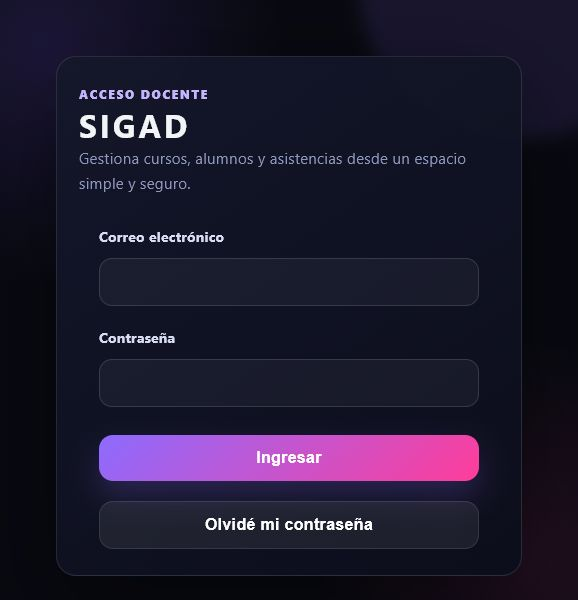

# S.I.G.A.D.

**Sistema Integral de Gestion de Asistencia Docente**

Aplicacion web para que docentes administren sus cursos, alumnos y asistencias desde un espacio propio. El sistema esta planteado como un servicio comercial: cada docente contrata un plan, presenta su comprobante de pago y, una vez aprobada la solicitud, puede gestionar hasta 10 cursos.

<p align="center">
  
</p>

## Descripcion

S.I.G.A.D. centraliza la gestion cotidiana de la asistencia docente y separa claramente las responsabilidades de cada usuario:

- Cada docente crea y administra solamente sus propios cursos.
- Cada cuenta docente puede tener hasta 10 cursos activos.
- El administrador supervisa el sistema, los docentes, pagos y solicitudes.
- El administrador tambien puede utilizar la aplicacion como docente y crear sus propios cursos.
- Antes de eliminar un curso se genera un informe con sus datos.
- Las personas interesadas pueden solicitar el servicio y consultar publicamente el estado de su solicitud.

## Funcionalidades principales

### Gestion docente

- Inicio de sesion y cierre de sesion.
- Recuperacion y cambio de contrasena.
- Perfil del docente.
- Creacion, edicion y administracion de cursos propios.
- Limite de 10 cursos por docente.
- Alta, edicion y baja de alumnos.
- Registro de asistencias por fecha.
- Interfaz de asistencias adaptada a celulares.
- Confirmaciones visibles, indicadores de carga y mensajes de error claros.
- Avisos anticipados de vencimiento de la suscripcion.
- Exportacion del informe completo antes de eliminar un curso.

### Administracion

- Visualizacion y administracion de todos los cursos.
- Gestion de cuentas docentes.
- Revision de comprobantes de pago.
- Aprobacion o rechazo de pagos y solicitudes.
- Activacion y control de suscripciones.
- Seguimiento general del uso del sistema.

### Experiencia comercial

- Landing publica con descripcion del servicio.
- Plan mensual: **$10.000**.
- Plan cuatrimestral: **$36.000**.
- Plan anual: **$96.000**.
- Formulario publico de solicitud con carga de comprobante.
- Consulta publica del avance de una solicitud.
- Informacion sobre medios de pago, condiciones, privacidad y contacto.

## Capturas

### Pagina principal

<p align="center">
  
</p>

### Acceso docente

<p align="center">
  
</p>

> Las pantallas internas requieren una cuenta autorizada y datos locales de PocketBase.

## Tecnologias

- **Frontend:** React 19, React Router y Vite.
- **Backend:** PocketBase.
- **Base de datos:** SQLite, administrada por PocketBase.
- **Alertas y confirmaciones:** SweetAlert2.
- **Informes:** jsPDF y jsPDF AutoTable.
- **Estilos:** CSS responsivo propio.

## Estructura local

El proyecto se ejecuta mediante dos servicios:

```text
SIGAD/
|-- SIGAD-frontend/       # Aplicacion React
|-- pocketbase/           # Backend local
    |-- pb_hooks/         # Reglas y logica del servidor
    |-- pb_migrations/    # Estructura versionada de la base de datos
    |-- pb_data/          # Datos locales, no deben publicarse
```

Colecciones principales de PocketBase:

- `users`
- `cursos`
- `alumnos`
- `asistencias`
- `pagos`
- `solicitudes`

## Requisitos

- Node.js 20 o superior.
- npm.
- PocketBase para Windows incluido en la carpeta local `pocketbase`.

## Ejecucion local

### 1. Iniciar PocketBase

Desde la carpeta `pocketbase`:

```powershell
.\pocketbase.exe serve
```

PocketBase quedara disponible normalmente en:

- Aplicacion/API: `http://127.0.0.1:8090`
- Administracion: `http://127.0.0.1:8090/_/`

### 2. Iniciar el frontend

Desde la carpeta `SIGAD-frontend`:

```powershell
npm install
npm run dev
```

La aplicacion quedara disponible normalmente en `http://localhost:5173`.

## Comandos disponibles

```powershell
npm run dev      # Inicia el entorno de desarrollo
npm run build    # Genera la version lista para publicar
npm run lint     # Revisa la calidad del codigo
npm run preview  # Previsualiza localmente la compilacion
```

## Roles y permisos

| Funcion | Docente | Administrador |
|---|:---:|:---:|
| Ver sus propios cursos | Si | Si |
| Crear hasta 10 cursos propios | Si | Si |
| Administrar cursos de otros docentes | No | Si |
| Gestionar alumnos y asistencias propias | Si | Si |
| Gestionar docentes | No | Si |
| Revisar pagos y solicitudes | No | Si |
| Activar suscripciones | No | Si |

## Seguridad y datos

- No se deben subir a GitHub `pb_data`, copias de seguridad, comprobantes reales, ejecutables de PocketBase ni credenciales.
- Las reglas de acceso de PocketBase deben mantenerse activas para impedir que un docente consulte datos ajenos.
- En produccion se debe utilizar HTTPS, una cuenta administradora segura y copias de respaldo externas.
- La recuperacion de contrasena requiere configurar un servidor de correo SMTP en PocketBase.
- Los datos personales y comprobantes deben tratarse de acuerdo con la politica de privacidad publicada en la aplicacion.

## Estado del proyecto

La experiencia funcional y visual principal esta implementada. Antes del despliegue publico quedan estas tareas de infraestructura:

1. Reemplazar la direccion local fija de PocketBase por una variable de entorno.
2. Preparar el backend para versionado sin incluir datos privados.
3. Contratar y configurar un servidor con dominio y HTTPS.
4. Configurar SMTP para la recuperacion real de contrasenas.
5. Automatizar copias de seguridad externas.
6. Ejecutar una prueba integral en el entorno publicado.

La opcion de despliegue prevista es un servidor VPS con el frontend estatico, PocketBase ejecutandose como servicio y un proxy web con HTTPS.

## Compilacion para produccion

```powershell
npm run build
```

El resultado se genera en `dist/`. Esta carpeta contiene el frontend estatico, pero PocketBase y su almacenamiento persistente deben desplegarse y configurarse por separado.

## Documentacion del trabajo

El analisis, alcance y especificacion funcional del sistema se encuentran en los documentos academicos asociados al proyecto. Este README resume el estado tecnico y operativo de la aplicacion.

## Licencia

Proyecto desarrollado con fines academicos y de futura explotacion comercial. No se concede permiso de uso, copia o redistribucion sin autorizacion de su titular.
